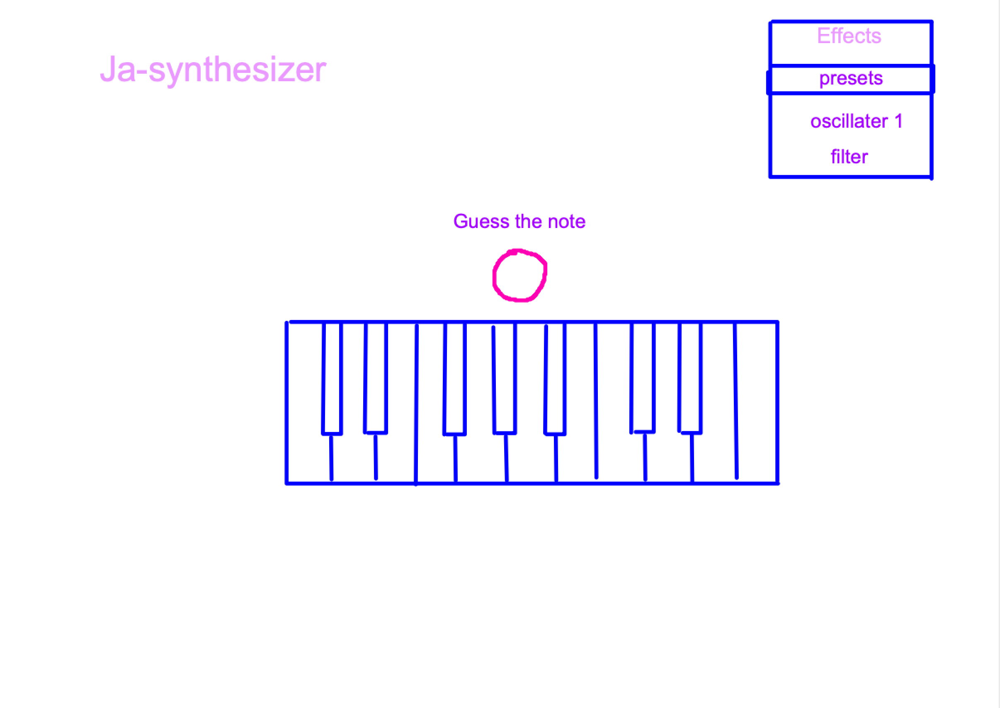

# Ja-synthesizer Game
View synthesizer game [here!](https://cintakins.github.io/synthGame/)

The game helps people practice their listening skills whilst also providing a fun with playing with sound effects, a little bit like a real synthesizer.

## The website on different viewports.

# User Experience (UX)
First time visitors need the presentation to be clear, minimalistic, understandable and quick learnt with simple instructions. This is to ensure they don't get put off trying the game by being overwhelmed with information. The game simply has a button that plays a sound and a synth keyboard to guess and play the note with. This helps train their ear to recognise the notes being played. A correct guess results in a visual reward, such as the key lighting up green, and an incorrect guess results in the key turning so that the player knows that they guessed incorrectly. This can be useful for musicians wanting to be able to quickly recognise notes and keys in order to help them make musical decisions when jamming, or creating music. Examples of the type of people who might find this useful are music producers, jazz musicians or music therapists.

Returning visitors may return because they find the game useful, however the game is very simple an doesn't do more beyond helping the player recognise notes by ear. The synthesizer offers some extra features for a little more fun. These features are pre-made sounds that the player can choose from and some audio parameters to tweak. This feature can teach the player a bit about different synthesizer parameters that can be altered.

# Design
The website has the colours pink, pruple, blue and black as I've often seen electronic music producers have a preference for those colours. The font is something basic and easy to read the font isn't anything fancy as there is not much writing on the page. The keys of the synthesizer catch the eye when the visitor opens the page so that they soon figure out what the page can do. The button for playing the audio game is above the synth keys to illustrate that the button needs to be pressed first in order to play the game. The Fonts I have chosen for the website are: Fredoka and Syne Mono.

# Wireframes
## Computer screen

## Tablet screen and smaller

# Features
- Synthesizer: The synthesizer keyboard has only one octave as it doesn't need more than that in order to guess the note.
- Guess-the-note play button: This button plays a note and starts the game function which changes the colour of the keys so that the correct key changes to green and the incorrect colour changes to red. After the guess has been made, there is an alert to encourage the player on their attempts and gives further instructions on what they can do next; continue playing the guessing game or continue playing the keyboard as it is.
- Presets: A selection of sounds the player can choose from.
- Audio parameters: Effects that the player can adjust, such as the volume and reverb.

# Technologies used
## Languages

- HTML5
- CSS
- JavaScript

## Frameworks, Libraries and Programs
- Bootstrap 5 - This was used for some of the layout and the play button.
- Font Awesome - fonts used were Fredoka and Syne Mono.
- Tone.js - this provided the sounds that play when the buttons are clicked as well as the effects.
- NesusUI - this was used to get the sliders for the volume and reverb effects, but in retrospect I would like to have coded my own sliders. This would have helped the webpage load quicker, and work more efficiently.
- Gitpod - for the creation of the project code.
- Github - Github was used to store the project code when code was commited and pushed to the website.
- ActivInspire - Use to illustrate the wireframes.

# Testing

I got a few people to try the game. Whenever I tested it myself I played the keys fast, played the game, deliberately getting it wrong or right, and did both using effects. Other players did the same and the same issues were reported from each as I was getting myself. If the keys were "smashed" (played in quick succession) the sounds stopped working and the colours di not revert back to the default keyboard colours. The game also struggled to play on modile phone devices. The game did not work as well on safari and i believe that Tone.js may not be compatible with safari. however the game works well when played normally in a relaxed thoughtful way. it's not easy to click the keys in quick succession, so it's not a problem that should be too common.

The website was passed through different validating services such as JShint for javascript, jigsaw.w3.org/css-validator for CSS, and validator.w3.org for HTML.

I also ran a lighthouse report on google dev tools to check for any problems.

## User Stories

Visitors to the site are presented with a clear layout of the game and simple, understandable instructions for starting the game. On playing the game players can grasp how good they are at knowing the note played to them and get an idea of how accurate their guesses are as the correct note shows up green and the incorrect note shows red. After each turn, they are given further instructions, letting them know that they can either continue playing the game or play the synthesizer without the game. 

## Bugs and problems
Struggled to organise the colour changes; 1. for when the player is clicking on keys without playing the game. 2. to show the player the correct and incorrect keys when playing the game. Often the keys reverted back to the wrong colour. I found that using "this" was causing the problems and had to use more specific lines of code which were much longer.

I decided to add an alert to congratulate or commiserate the user on their efforts, but this caused problems for playing the synth after, without the game function. One problem was that I was attempting to remove the alert message automatically and accidentally removed the wrong HTML element so that the function to alert again couldn't use the append method on the removed item.  After that i realised that the value that was supposed to hold the element of the note played (keyPlayed) wasn't passing through any information. Everything worked after sorting that issue out, except the repeating alert problem. I fixed that problem by adding {once: true} after calling the alert function.

When the effects are selected and keys are clicked in quick succession, the keys stop working. a sign pops up in the console saying that these things:

I believe that this may be a problem with the tone.js API and that maybe using another sound source, or uploading my own sounds might have been a better choice, but I believe that using tone.js was worth exploring as I could find out what sort of resources already exist.

## What I would have liked to have done differently and what I might change in the future.

I would like to have added more effects. I really enjoyed making this game because I love music and have been learning about synthesizer effects. I would have also liked to have improved the 'delay' sound effect as the initial sound is too delayed. Maybe the game could have counted correct and incorrect notes and given a score at the end, but I was more interested in creating this as a practice tool for listening practice as i'm interested in learning how to improvise and learning how to instantly create music based on what sounds are presented to me. I also wanted to concentrate on the sound effects aspect because I would love to work on musical technology in the future.

One HTML aspect I would like to have changed given I had more time is the volume and reverb sliders. I only realised late in the project that I could have created those myself without the use of NexusUI which slowed down the loading time of the game. It was an unecessary resource in the webpage in my opinion and could have been improved by making it myself. It would have also improved the accessibility of the HTML elements. 

# Deployment

The website was deployed by logging into github, finding the repository, going into setting then pages. When on pages, select main branch, then save. The website then appeared at the top of the page, ready to be clicked on.

# Credits

Thank you to all the tutors and mentor at code institute. I really appreciate the help I had with this.
